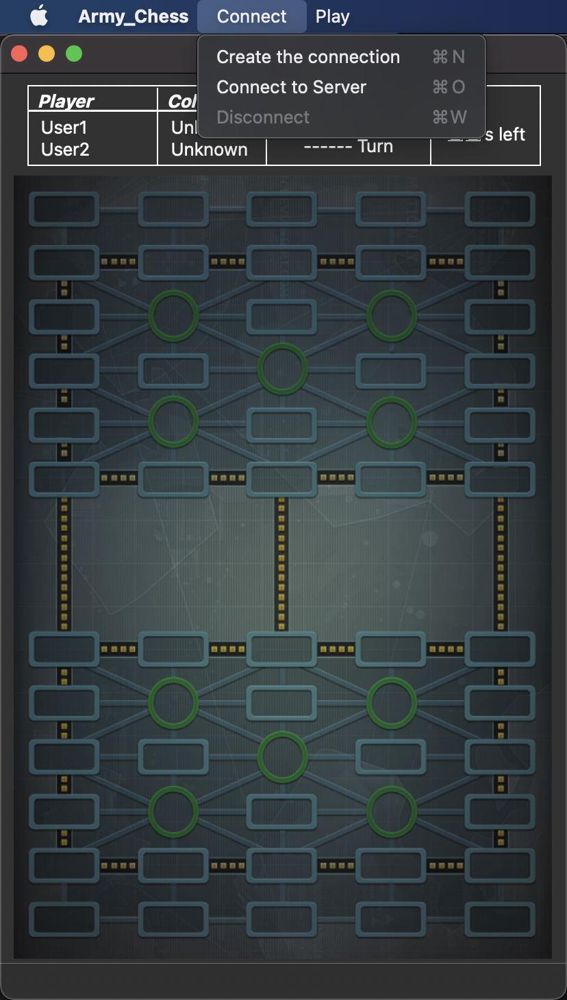
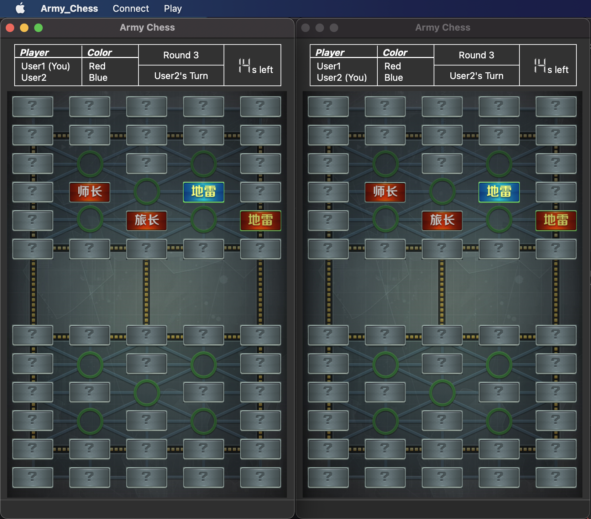

## Army Chess设计文档
> 姓名：王昊华  
> 学号：2020010942  
> 项目：Army Chess  

#### 客户端、服务器端的工作流程
1. 当服务器端点击菜单栏中Create the connection后， 新建`QTcpServer`类的对象`listenSocket`，该`listenSocket`监听本机IPv4 IP地址，等待客户端的连接。
2. 当客户端点击菜单栏中Connect to Server后输入服务器端的IP时，客户端接入连接：
	1. 触发服务器端信号函数`newConnection()`，其中`listenSocket`下的两个槽函数`acceptConnection()`与`slotConnected()`函数被触发：
		1. `acceptConnection()`函数中将`listenSocket`的下一待决连接（即客户端）赋值给服务器端的`readWriteSocket`，其为`QTcpSocket`类的对象；
		2. `slotConnected()`函数一方面让菜单栏中Start和Disconnect可用，另一方面设置检查当前连接状态的函数`update_DeviceNetState()`，该函数每1000ms由`readWriteSocket`写入空白内容`“”`，并通过返回值是否为`-1`来判断连接是否正常；若连接中断则提醒本机并终止游戏。
	2. 触发客户端信号函数`connected()`和`readyRead()`，该两个函数分别与槽函数`slotConnected()`与`recvMessage()`相连：
		1. `slotConnected()`函数如服务器端功能一致；
		2. `recvMessage()`用以读取对方`readWriteSocket`传来的数据，通信协议部分在这里在该函数内实现。
	3. 两方`readWriteSocket`均可调用`sendMessage()`函数，该函数将需要传输的数据以`QString`的`toUtf8()`函数转`QByteArray`格式，再调用`data()`获取`char*`格式数据来写入，等待对方读取。
3. 两方均点击菜单栏中Start后，由先点击Start的一方随机确定先手玩家、生成随机发棋序列，并通过`readWriteSocket`将这两个信息传输给另一方，使得两方的玩家次序、棋面一致；界面显示信息提示先手玩家翻棋子，并依次轮流在界面显示当前走棋方，提示玩家交替翻棋，直到确定玩家阵营，界面处显示各自对应的阵营颜色。
4. 走棋过程中，两方的`readWriteSocket`在本局玩家点击棋面或点击菜单栏Admit the defeat，只需将点击棋面或点击Admit the defeat的数据传输给对方，完成数据传输后再各自调用各自与游戏逻辑相关的函数来判断是否能走子、吃子、超时、更新棋盘、结束游戏等；具体点击棋面数据的传输规则见通信协议的约定。
5. 仍然是走棋过程中，两方中任一方关闭界面、意外掉线、主动点击菜单栏Disconnect，另一方界面均会因`update_DeviceNetState()`检测到对方掉线而终止游戏；其中主动点击菜单栏Disconnect的方法，该主动方`readWriteSocket`调用`QTcpSocket`类`disconnectFromHost()`函数，并终止游戏。

_（可参考附件2中流程图）_

#### 二者通信协议
1. 原始数据存储在`QString`类型的`messageSent`变量中，在`sendMessage()`函数中进行转码：先调用`QString`类的`toUtf8()`函数将`messageSent`转成`QByteArray`格式，并添加在空白`QByteArray`类型的`array`变量中；再调用`QByteArray`类的`data()`函数获取`array`的`char*`格式数据，由`readWriteSocket`调用`QTcpSocket`类的`write()`函数写入数据。
2. 通信协议部分在`recvMessage()`函数中实现，在调用`QTcpSocket`类的`readAll()`函数，将上述`QString`转`QByteArray`再转`char*`的数据，存储到`messageRecv`这一`QString`变量中后，通过`if`-`else`语句处理读入的`messageRecv`数据：
	1. 若`messageRecv`以`“actionStart”`开头，将初始值为`false`的`ableStart_else`变量改为`true`（该变量在`start()`函数中判断对方是否已经点击了开始，若对方或己方点击了开始则会改变己方`ableStart_else`的值，使己方或对方无需再随机决定先手、生成发棋序列，而直接根据已有信息生成棋盘、界面信息）：
		1. 若`messageRecv`在`“actionStart”`后跟`“_1”`，己方需要接受对方的随机先手、棋序信息，并将己方设为user2（对方为user1，其中user1为两方中先点击菜单栏Start中的玩家）：
			1. 随机先手信息：若`messageRecv`在`“actionStart_1”`后跟`“1”`，则对方生成的确定先手的随机数`randNum`为`1`；若跟`“0”`，则`randNum`为`0`（若`randNum`为`1`，则对方user1先行；若`randNum`为`0`，则对方user1后行）；
			2. 棋序信息：`messageRecv`在`“actionStart_1x”`（`x`为上述所说随机先手信息，为`1`或`0`）后有50个（`messageRecv`的第14至63个）`char`型字符，该50个字符通过`std::map int_to_char`在生成序列方将`randomArray`中存储的`int`型转码为一一对应的char型后，此时在接收方处由`std::map char_to_int`再转码回`int`，存储到己方`int*`型`randomArray`数组中。
		2. 若`messageRecv`在`“actionStart”`后跟`“_2”`，调用`start()`函数。
	2. 若`messageRecv`以`“switch_turn_unmask”`开头，`messageRecv`的第18个字符（即“`switch_turn_unmaskx”`中的`x`代表的字符）存储了`unknownBtn`的`char`型`id`信息，同上述`std::map char_to_int`转码方式获取`int`型`id`后，调用`unknownBtn[id]->switch_turn_unmask()`函数，即指定翻棋操作。
	3. 若`messageRecv`以`“press_chessBtn”`开头，`messageRecv`的第14个字符存储了`chessBtn`的`id`信息，获取`int`型`id`：
		1. 调用`chessBtn[id]->press_own_chessBtn()`函数，即点击己方指定棋子操作；
		2. 调用`chessBtn[id]->press_other_chessBtn()`，即点击对方指定棋子操作。
	4. 若`messageRecv`以`“press_emptyBtn”`开头，`messageRecv`的第14个字符存储了`emptyBtn`的`id`信息，获取`int`型`id`，调用`emptyBtn[id]->press_emptyBtn()`函数，即点击棋盘内指定空白区域操作。
	5. 若`messageRecv`以`“admit_defeat“`开头，调用`show_clock(-101)`来立即结束当前轮次倒计时：
		1. 若`messageRecv`在`“admit_defeat“`后跟`“next”`，则调用`endGame(nextPlayer)`，即游戏以`nextPlayer`玩家获胜而终止；
		2. 若`messageRecv`在`“admit_defeat“`后跟`“cur”`，则调用`endGame(currentPlayer)`，即游戏以`currentPlayer`玩家获胜而终止。

_（可参考附件2中流程图）_

#### 网络通信编程框架
1. 框架：C/S模式TCP通信，阻塞方式的socket编程， 基于数据块的通信。
2. 类：`QTcpServer`和`QTcpSocket`。
3. 函数：
	1. `QTcpServer`：`listen(const QHostAddress, quint16), newConnection(), nextPendingConnection()`；
	2. `QTcpSocket`：`connectToHost(const QHostAddress, quint16), connected(), readyRead(), write(), readAll(), disconnectFromHost()`。

_（可参考附件2中流程图）_

#### 信号与槽机制设计
1. `ChronoMarker`类（继承自`QObject`，用来记录20s倒计时；较为重要的成员变量为`QTimer`类的`timer`）：
	1. `connect(timer, SIGNAL(timeout()), this, SLOT(on_timer_out()))`：每次`timer`的interval（1000ms）倒计时完毕（即`timeout()`信号触发），调用`on_timer_out()`函数使得`ChronoMarker`中`int`型成员变量`second--`，起到每秒钟秒数减1的效果
2. `MainWindow`类（继承自`QMainWindow`，主界面、棋子、服务器端与客户端Socket、游戏规则处理函数均为该类的成员对象或成员函数）：
	1. `connect(listenSocket, SIGNAL(newConnection()), this, SLOT(acceptConnection()))，connect(listenSocket, SIGNAL(newConnection()), this, SLOT(slotConnected()))`：当有新的连接时`newConnection()`信号发射，调用`acceptConnection()`槽函数，接受客户端连接并获得相关联的 `QTcpSocket`对象`readWriteSocket`用于通信；同时调用`slotConnected()`槽函数，激活部分菜单栏，并设置时刻检查当前连接状态的机制；
	2. `connect(readWriteSocket, SIGNAL(readyRead()), this, SLOT(recvMessage()))`：当`readWriteSocket`的缓冲区有新数据需要读取时，发射`readyRead()`信号，调用`recvMessage()`来读取新数据；
	3. `connect(readWriteSocket, SIGNAL(connected()), this, SLOT(slotConnected()))`：`connectToHost()`成功连接后发射`connected()`信号，调用`slotConnected()`，功能同上；
	4. `connect(checkState, SIGNAL(timeout()), this, SLOT(update_DeviceNetState()))`：`QTimer`类`checkState`的interval（1000ms）倒计时完毕（即`timeout()`信号触发），调用`update_DeviceNetState()`槽函数检测对方是否掉线；
	5. `connect(clock, SIGNAL(freshSignal(int)), this, SLOT(show_clock(int)))`：`ChronoMarker`类的对象`clock`在`ChronoMarker`成员变量`QTimer timer`倒计时1s后会触发`on_timer_out()`槽函数，该函数发射信号函数`freshSignal(second)`，其中`int`型`second`成员变量为当前秒数，传递该`int`型参变量给`show_clock(int)`槽函数，来设置界面的倒计时器；
	6. `connect(unknownBtn[i], SIGNAL(clicked()), unknownBtn[i], SLOT(switch_turn_unmask()))，connect(unknownBtn[i], SIGNAL(clicked()), unknownBtn[i], SLOT(switch_turn_unmask_message()))`（`i`取1到50）：当`UnknownButton`类的对象`unknownBtn[i]`（继承自`QPushButton`）被点击而发射`clicked()`信号，调用`switch_turn_unmask()`与`switch_turn_unmask_message()`槽函数，其中`switch_turn_unmask()`处理翻棋，`switch_turn_unmask_message()`传递翻棋数据给另一方玩家程序；
	7. `connect(chessBtn[i], SIGNAL(clicked()), chessBtn[i], SLOT(press_own_chessBtn()))，connect(chessBtn[i], SIGNAL(clicked()), chessBtn[i], SLOT(press_other_chessBtn()))，connect(chessBtn[i], SIGNAL(clicked()), chessBtn[i], SLOT(press_chessBtn_message()))`（`i`取1到50）：当`ChessButton`类的对象`chessBtn[i]`（继承自`QPushButton`）被点击而发射`clicked()`信号，调用`press_own_chessBtn()`、`press_other_chessBtn()`与`press_chessBtn_message()`槽函数，其中`press_own_chessBtn()`、`press_other_chessBtn()`分别处理点击己方棋子、点击对方棋子，`press_chessBtn_message()`传递点击己方棋子、点击对方棋子的数据给另一方玩家程序；
	8. `connect(emptyBtn[i], SIGNAL(clicked()), emptyBtn[i], SLOT(press_emptyBtn()))，connect(emptyBtn[i], SIGNAL(clicked()), emptyBtn[i], SLOT(press_emptyBtn_message()))`（`i`取1到60）：当`ChessButton`类的对象`emptyBtn[i]`（继承自`QPushButton`）被点击而发射`clicked()`信号，调用`press_emptyBtn()`与`press_emptyBtn_message()`槽函数，其中`press_emptyBtn()`处理点击棋盘空白处，`press_emptyBtn_message()`传递点击棋盘空白处的数据给另一方玩家程序；
	9. `connect(ui->actionCreate_the_connection, &QAction ::triggered, this, &MainWindow::open_server_panel)，connect(ui->actionStart, &QAction::triggered, this, &MainWindow::start)，connect(ui->actionAdmit_the_defeat, &QAction::triggered, this, &MainWindow::admit_defeat)，connect(ui->actionDisconnect, &QAction::triggered, this, &MainWindow::disconnect)`：将`MainWindow`成员变量`ui`菜单栏中的`QAction`对象的信号触发`triggered()`（点击或快捷键触发）与各自对应需要调用的槽函数做关联。

_（可参考附件1中流程图）_

#### GUI 界面设计
1. 主菜单界面：
	1. “Connect”菜单栏：“Create the connection”（服务器端创建服务器监听）、“Connect to Server”（客户端加入连接）、”Disconnect“（任一方取消连接）的菜单项；
	 
	2. “Play”菜单栏：”Start“（开始游戏）、”Admit the defeat“（投降）的菜单项。
	
2. 创建服务器界面：
	1. 点击主菜单“Create the connection”菜单项；
	2. 弹出创建连接对话框，创建连接对话框中包括服务器端IP显示框“Host IP: xxx.xxx.xxx.xxx”文本、“OK”按钮及“Cancel”按钮：
	 
		1. 点击“OK”按钮，创建链接对话框消失，并绘制棋盘，等待连接请求；
		
		2. 点击“Cancel”按钮，创建链接对话框消失。
3. 客户端连接界面：
	1. 点击主菜单“Connect to Server”菜单项；
	2. 弹出连接服务器对话框，连接服务器对话框中包括需要连接的服务器端的IP输入框“Enter IP: “文本框、”Cancel“按钮、”OK“按钮，以及数字键盘：
		
		1. 在数字键盘或电脑键盘中键入服务器端IP地址后，点击“OK”，完成连接，并绘制棋盘；
		2. 若IP地址输入格式错误或不存在这一IP连接（IP地址不合法），弹出输入错误对话框，输入错误对话框中包含信息”Invalid IP! Please re-enter.“文本、”Cancel“按钮、”OK“按钮：
			
			1. 点击“Cancel”，输入错误对话框消失；
			2. 点击“OK”，输入错误对话框消失，并重新弹出连接服务器对话框以重新输入。
4. 下棋界面：
	1. 双方都点击主界面菜单项“Start”后，开始游戏，进入下棋界面。
	 
	2. 初识棋盘状态，所有棋子均未知，后玩家逐一翻棋，确定阵营后可按游戏规则进行走棋、吃子。
	 
	3. 棋局信息栏：
		
		1. Player：开局前为标有“User1”、“User2”文本（默认为“User1”、“User2”，可在后台修改），开局后对应玩家在该Player文本后标记有“(You)”字样（如：”User1 (You)”）；
		2. Color：同一玩家连续两次翻同色棋确定阵营前标有“Unknown”、“Unknown”文本（对应User1、User2的颜色），确定阵营后字样改为该玩家对应的阵营颜色（如User1对应“Blue”，User2对应“Red”）；
		3. Round：记录轮数，一轮为2步行动（两方各走一次的2步行动为一轮，翻棋、走子、吃子、超时均算一步行动）；
		4. Turn：记录轮到哪一方玩家行动（如“User2’s Turn”为User2行动），在出现某一方胜利后会显示“xxx Wins!”（如“User1 Wins!”为User1胜利）；
		5. xx s left：计时器从20s开始倒计时，每秒更新一次用LCD显示当前玩家剩余行动时间；若提前行动完会立刻交换棋权并更新计时器重新从20s开始倒计时，否则将倒计时到0s再进行期权交换并更新计时器；游戏结束后清零，LCD显示88s。
5. 断开连接提示弹窗：点击主界面菜单项“Disconnect”后，己方弹出断开连接提示弹窗，显示“Are you sure to disconnect? The game will end immediately.”文本、“Back to Game”按钮、“Disconnect”按钮：
  
	1. 点击“Back to Game”按钮，关闭断开连接提示弹窗，回到主界面继续游戏；
	2. 点击“Disconnect”按钮，关闭断开连接提示弹窗，与对方断开连接，回到主界面，游戏结束。
6. 对方掉线提示弹窗：对方点击“Disconnect”主动断开连接或意外掉线而断开连接，己方均会弹出对方掉线提示弹窗，显示“Your opponent is currently offline. Please end game.”文本、“End Game”按钮；点击“End Game”按钮，关闭对方掉线提示弹窗，回到主界面，游戏结束。
  
7. 投降提示弹窗：点击“Admit the defeat”菜单项，弹出投降提示弹窗，显示‘Are you sure to admit the defeat? You will immediately lose after choosing "Yes,  I admit’文本、”Back to Game“按钮、”Yes, I admit“按钮：
  
	1. 点击”Back to Game“按钮，关闭投降提示弹窗，回到主界面继续游戏；
	2. 点击”Yes, I admit“按钮，关闭断开连接提示弹窗，回到主界面，以对方胜利终止游戏（两方均会弹出胜负弹窗）。
8. 胜负弹窗 ：如果出现一方胜利（拔了对方旗、对方无棋可走、对方投降），两方界面均会弹出胜负弹窗，显示“xxx Wins!”文本、“OK”按钮；点击“OK”按钮，关闭胜负弹窗，回到主界面，游戏结束（如User2胜利，两方胜负弹窗中均显示“User2 Wins!”）。
    

_（可参考附件1中流程图）_

#### **_References:_**

*https://blog.csdn.net/plm199513100/article/details/86516123*
*https://www.cnblogs.com/Doyoung/p/13160803.html*
*https://blog.csdn.net/chinabinlang/article/details/31760559*
*https://c.runoob.com/front-end/854*
*https://blog.csdn.net/taoerit/article/details/76013890*
*https://jingyan.baidu.com/article/d3b74d64338fd31f76e60976.html*
*https://dengjin.blog.csdn.net/article/details/115121894*
*https://blog.csdn.net/technologyleader/article/details/82497427*
*https://blog.csdn.net/weixin_42189888/article/details/106265062*
*http://shouce.jb51.net/qt-beginning/43.html*
*https://www.cnblogs.com/code-fisher/p/7390867.html*
*https://blog.csdn.net/weixin_30644369/article/details/97293836*